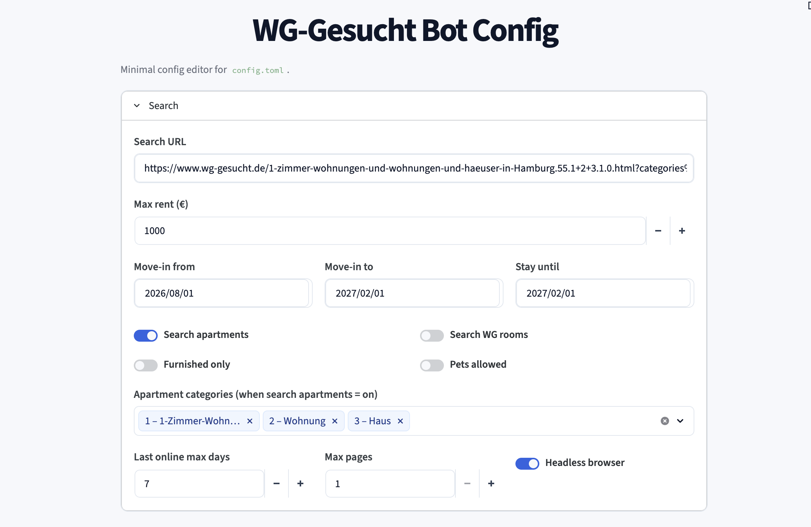
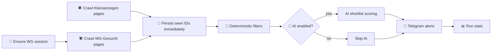
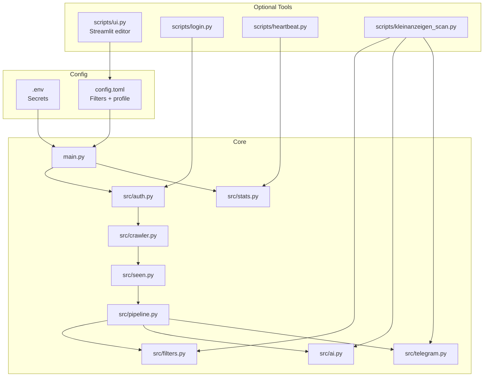
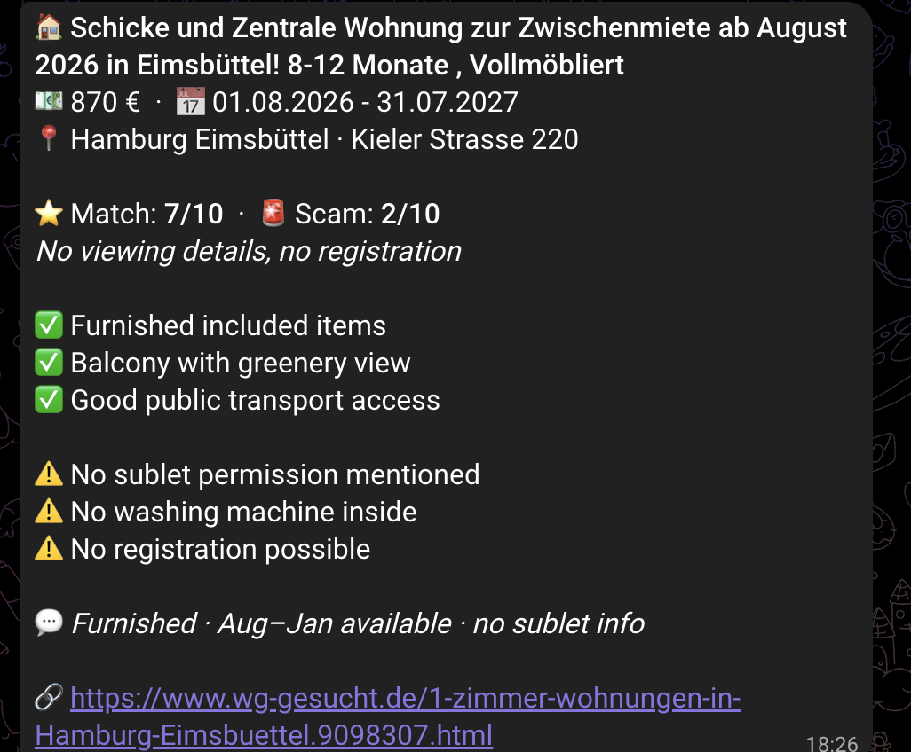

<div align="center">
<h1>WG-Gesucht Agent</h1>

<p>
  <b>One feed. One filter pass. Only listings you actually care about.</b><br/>
  WG-Gesucht + Kleinanzeigen crawlers, deterministic filtering, optional AI scoring, Telegram delivery.
</p>

<p>
  
  
  
  
</p>



</div>

## What It Does

A renter configures budget, date window, district list, and living preferences. The bot scans:

- WG-Gesucht listings
- Kleinanzeigen rental listings

Then it:

- logs in with your WG account session
- crawls fresh listings with Playwright
- deduplicates against persisted seen IDs
- applies deterministic hard filters
- optionally runs AI analysis on shortlist results
- sends compact Telegram alerts

Result: one low-noise apartment/WG deal feed instead of manual tab-refreshing across multiple sites.

## Why This Exists

This is exactly how I found my apartment for my internship in Hamburg. WG-Gesucht and Kleinanzeigen move fast — competitive listings are gone within hours. Manually refreshing tabs across two sites doesn't scale, and naive RSS-style alerts flood you with junk. Hard filters first (rent, dates, districts) then optional AI scoring on the shortlist gives you a clean, low-noise feed.

> Built and tested against Hamburg. Any WG-Gesucht city URL should work — only Hamburg is regularly verified.

## System Flow



<details>
<summary><b>Architecture Map</b> (for contributors)</summary>



</details>

## Quick Start

### Prerequisites

- Python `3.11+` (required by `tomllib`)
- Telegram bot token + your Telegram chat ID
- WG-Gesucht account credentials
- Optional: OpenAI API key (only if AI is enabled)

### 1) Install

```bash
# HTTPS (recommended for new users)
git clone https://github.com/bobocs50/wggesucht.git
# or SSH if you have a key set up:
# git clone git@github.com:bobocs50/wggesucht.git
cd wggesucht

python3 -m venv venv
source venv/bin/activate

pip install -r requirements.txt
playwright install chromium

cp .env.example .env
cp config.toml.example config.toml
```

### 2) Add secrets in `.env`

```env
TELEGRAM_BOT_TOKEN=...
TELEGRAM_CHAT_ID=...
WGG_EMAIL=...
WGG_PASSWORD=...
OPENAI_API_KEY=...   # only if [ai].enabled = true
# DATA_DIR=/path/to/persistent/storage
```

### 3) Configure with the Streamlit UI ⭐

This is the intended setup path — point-and-click instead of hand-editing TOML.

```bash
streamlit run scripts/ui.py
```

Open `http://localhost:8501`, fill in budget, dates, districts, WG type, and profile, then **Save**. The UI writes a validated `config.toml` and preserves any custom keys you've added.

For your first run, leave **AI** disabled until everything else works end-to-end.

<details>
<summary>Prefer to edit <code>config.toml</code> by hand?</summary>

Minimum fields:

- `[search].url` — pre-filtered WG-Gesucht search URL. Open WG-Gesucht in your browser, set city/category/etc., then copy the URL from the address bar.<br/>Example: `https://www.wg-gesucht.de/wg-zimmer-in-Hamburg.55.0.1.0.html`
- `[search].max_rent`
- `[search].move_in_from`
- `[search].move_in_to`
- `[search].stay_until`
- `[districts].preferred`
- `[ai].enabled = false` (for first run)

</details>

### 4) Create initial WG session

```bash
python scripts/login.py
```

### 5) Run bot

```bash
python main.py
```

If startup fails with missing `OPENAI_API_KEY`, either add the key in `.env` or set `[ai].enabled = false`.

### Verify first match

Keep things minimal for the first run (small district list, `max_pages = 1`, AI off). If you see filter results and at least one `→ MATCH` in the console — and the Telegram alert lands — setup is working.

<p align="center">
  
</p>

## Privacy

Your WG-Gesucht credentials, session cookies (`data/session.json`), and seen-listing history (`data/seen_ids.json`) stay on your machine. The bot only talks to WG-Gesucht, Kleinanzeigen, Telegram, and (optionally) OpenAI. Nothing is reported to the maintainers.

## Operations

### Daily heartbeat

```bash
python scripts/heartbeat.py
```

Sends Telegram summary with run count, matches, AI calls, relogins, errors, and session age.

### Kleinanzeigen scanner

```bash
python scripts/kleinanzeigen_scan.py
```

Uses the same filtering + optional AI evaluation pattern for Kleinanzeigen rentals.

## Config Reference

### `.env`

| Variable | Required | Purpose |
|---|---|---|
| `TELEGRAM_BOT_TOKEN` | Yes | Telegram bot auth |
| `TELEGRAM_CHAT_ID` | Yes | Destination chat |
| `WGG_EMAIL` | Yes | WG-Gesucht login |
| `WGG_PASSWORD` | Yes | WG-Gesucht login |
| `OPENAI_API_KEY` | Only if AI enabled | AI listing analysis |
| `DATA_DIR` | Optional | Override runtime storage path |

### `config.toml`

| Section | Purpose |
|---|---|
| `[search]` | URL, rent cap, date window, crawl depth, listing toggles |
| `[districts]` | preferred districts + optional city fallback |
| `[wg]` | flatshare size/type constraints |
| `[ai]` | model and per-run AI limits |
| `[profile]` | personal preference text inserted into AI prompt |

## Tests

```bash
python3 -m unittest -v                          # full suite
python3 -m unittest -v tests.test_filters       # single module
```

Covers filters, AI response parsing, seen-ID persistence, Telegram formatting, UI config merge, and a `main.py` smoke test. New tests go in `tests/test_<module>.py`. Full suite requires `requirements.txt` installed in the active venv.

## Runtime Guarantees

- 🔒 Secrets remain in `.env`; non-secret behavior remains in `config.toml`.
- 💾 Seen IDs are persisted before AI work, so a mid-run crash doesn't lose dedupe state.
- ♻️ Session expiry triggers re-login attempts automatically.
- 🧱 Deterministic filters run regardless of AI availability.

## Repository Layout

```text
src/
  auth.py            session validation + re-login
  crawler.py         WG-Gesucht scraping
  filters.py         deterministic listing filters
  pipeline.py        end-to-end decision pipeline
  ai.py              optional OpenAI evaluation layer + contact-note drafting
  contact.py         best-effort owner-name extraction (standalone, not yet wired into pipeline)
  telegram.py        Telegram notifier
  ui_config.py       Streamlit form validation + safe config merge
scripts/
  login.py           create/refresh WG session
  ui.py              Streamlit config editor
  heartbeat.py       daily bot health report
  kleinanzeigen_scan.py
  inspect_search.py         interactive crawler debugging
  inspect_contact_form.py   read-only probe for WG-Gesucht's contact-form DOM (never submits)
main.py              primary bot entrypoint
tests/               unit tests
```

**Note on contact drafting:** `src/contact.py` (owner-name extraction) and `ai.py::draft_apartment_note()`
(short per-listing note) exist as tested standalone building blocks for composing a ready-to-paste
WG-Gesucht contact message, delivered via Telegram for the user to send by hand. Full automated
form-submission was deliberately not built — WG-Gesucht's message-send endpoint sits behind Cloudflare
Bot Management and serves a logged-out wall to headless sessions even with valid login cookies.
Owner names are also often rendered as small images rather than text, another deliberate anti-scraping
measure — most drafts fall back to a generic salutation.

## Deployment

Designed to run as a cron job on any small Linux box. The author runs it on a **Hetzner Cloud CX23** instance for **€4.75 / month** — the whole pipeline (Playwright + OpenAI calls + Telegram) fits comfortably with headroom to spare.

Example crontab (WG-Gesucht every 10 min, Kleinanzeigen every 15 min offset by 5, daily heartbeat at 09:00):

```cron
*/10 * * * * cd /root/wggefunden && flock -n /tmp/wggefunden-main.lock timeout 600 /root/wggefunden/venv/bin/python3 main.py >> /var/log/wggefunden.log 2>&1
5-59/15 * * * * cd /root/wggefunden && flock -n /tmp/wggefunden-ka.lock timeout 900 /root/wggefunden/venv/bin/python3 scripts/kleinanzeigen_scan.py >> /var/log/wggefunden-ka.log 2>&1
0 9 * * * cd /root/wggefunden && timeout 120 /root/wggefunden/venv/bin/python3 scripts/heartbeat.py >> /var/log/wggefunden-heartbeat.log 2>&1
```

`flock -n` skips a tick if the previous run is still going, preventing overlapping writes to `data/stats.json` and `data/seen_ids.json`. `timeout` bounds Playwright/browser hangs so a stuck run can't block the next scheduled tick.

OpenAI usage with `[ai].enabled = true` and `MAX_AI_CALLS_PER_RUN = 3` typically stays under **$1 / month** on `gpt-4.1-mini`.

## Troubleshooting

- `ModuleNotFoundError`: activate venv and reinstall requirements.
- No Telegram alerts: re-check `TELEGRAM_BOT_TOKEN` and `TELEGRAM_CHAT_ID`.
- Login failures: verify `WGG_EMAIL`/`WGG_PASSWORD`, rerun `python scripts/login.py`.
- Too few matches: relax rent cap, district list, date window, or `last_online_max_days`.

## Contributing & License

- License: [MIT](LICENSE)
- Contributing: see [CONTRIBUTING.md](CONTRIBUTING.md)
- Security: report vulnerabilities per [SECURITY.md](SECURITY.md) — please do not open public issues for security problems.
