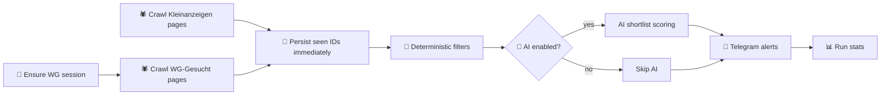
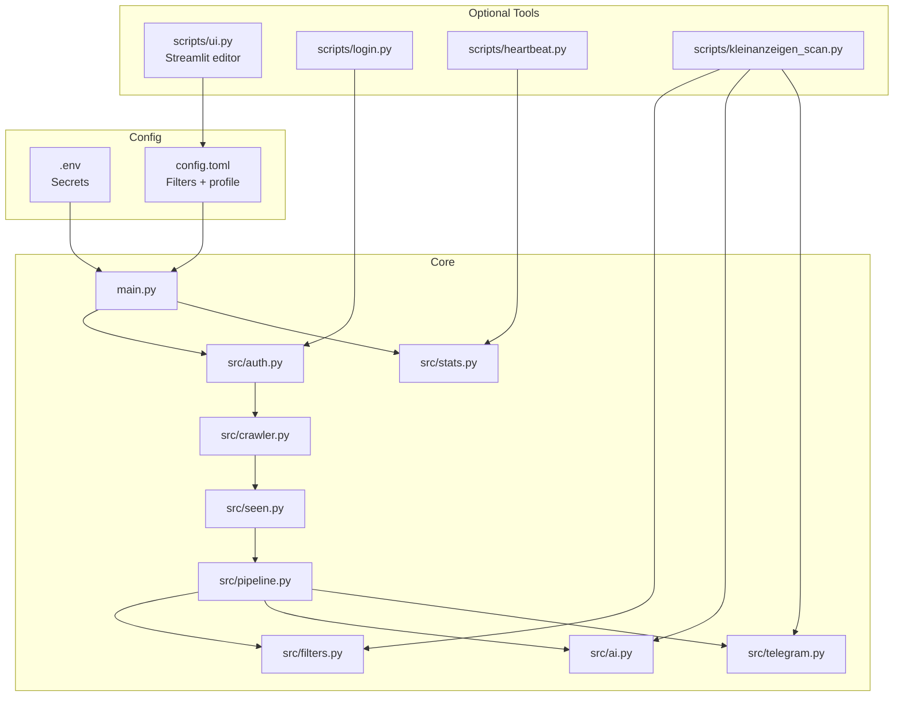

<div align="center">
<h1>WG-Gesucht Agent</h1>

<p>
  <b>One feed. One filter pass. Only listings you actually care about.</b><br/>
  WG-Gesucht + Kleinanzeigen crawlers, deterministic filtering, optional AI scoring, Telegram delivery.
</p>

<p>
  
  
  
  
  
</p>
</div>

## What It Does

A renter configures budget, date window, district list, and living preferences. The bot scans:

- WG-Gesucht listings
- Kleinanzeigen rental listings

Then it:

- logs in with your WG account session
- crawls fresh listings with Playwright
- deduplicates against persisted seen IDs
- applies deterministic hard filters
- optionally runs AI analysis on shortlist results
- sends compact Telegram alerts

Result: one low-noise apartment/WG deal feed instead of manual tab-refreshing across multiple sites.

## System Flow



## Architecture Map



## Quick Start

### Prerequisites

- Python `3.11+` (required by `tomllib`)
- Telegram bot token + your Telegram chat ID
- WG-Gesucht account credentials
- Optional: OpenAI API key (only if AI is enabled)

### 1) Install

```bash
git clone git@github.com:bobocs50/wggesucht.git
cd wggesucht

python3 -m venv venv
source venv/bin/activate

pip install -r requirements.txt
playwright install chromium

cp .env.example .env
cp config.toml.example config.toml
```

### 2) Add secrets in `.env`

```env
TELEGRAM_BOT_TOKEN=...
TELEGRAM_CHAT_ID=...
WGG_EMAIL=...
WGG_PASSWORD=...
OPENAI_API_KEY=...   # only if [ai].enabled = true
# DATA_DIR=/path/to/persistent/storage
```

### 3) Configure search in `config.toml`

Minimum fields:

- `[search].url`
- `[search].max_rent`
- `[search].move_in_from`
- `[search].move_in_to`
- `[search].stay_until`
- `[districts].preferred`

For first run, keep AI off:

- set `[ai].enabled = false`

### 4) Create initial WG session

```bash
python scripts/login.py
```

### 5) Run bot

```bash
python main.py
```

If startup fails with missing `OPENAI_API_KEY`, either add the key in `.env` or set `[ai].enabled = false`.

## Optional UI

```bash
streamlit run scripts/ui.py
```

Open `http://localhost:8501`

UI writes `config.toml` with validation and preserves unknown/custom keys during save.

## Operations

### Daily heartbeat

```bash
python scripts/heartbeat.py
```

Sends Telegram summary with run count, matches, AI calls, relogins, errors, and session age.

### Kleinanzeigen scanner

```bash
python scripts/kleinanzeigen_scan.py
```

Uses the same filtering + optional AI evaluation pattern for Kleinanzeigen rentals.

## Config Reference

### `.env`

| Variable | Required | Purpose |
|---|---|---|
| `TELEGRAM_BOT_TOKEN` | Yes | Telegram bot auth |
| `TELEGRAM_CHAT_ID` | Yes | Destination chat |
| `WGG_EMAIL` | Yes | WG-Gesucht login |
| `WGG_PASSWORD` | Yes | WG-Gesucht login |
| `OPENAI_API_KEY` | Only if AI enabled | AI listing analysis |
| `DATA_DIR` | Optional | Override runtime storage path |

### `config.toml`

| Section | Purpose |
|---|---|
| `[search]` | URL, rent cap, date window, crawl depth, listing toggles |
| `[districts]` | preferred districts + optional city fallback |
| `[wg]` | flatshare size/type constraints |
| `[ai]` | model and per-run AI limits |
| `[profile]` | personal preference text inserted into AI prompt |

## Tests

```bash
python3 -m unittest -v
python3 -m unittest -v tests.test_ui_config
```

Note: full test suite requires all dependencies from `requirements.txt` in the active venv.

## Runtime Guarantees

- 🔒 Secrets remain in `.env`; non-secret behavior remains in `config.toml`.
- 💾 Seen IDs are persisted before AI work, so a mid-run crash doesn’t lose dedupe state.
- ♻️ Session expiry triggers re-login attempts automatically.
- 🧱 Deterministic filters run regardless of AI availability.

## Repository Layout

```text
src/
  auth.py            session validation + re-login
  crawler.py         WG-Gesucht scraping
  filters.py         deterministic listing filters
  pipeline.py        end-to-end decision pipeline
  ai.py              optional OpenAI evaluation layer
  telegram.py        Telegram notifier
  ui_config.py       Streamlit form validation + safe config merge
scripts/
  login.py           create/refresh WG session
  ui.py              Streamlit config editor
  heartbeat.py       daily bot health report
  kleinanzeigen_scan.py
main.py              primary bot entrypoint
tests/               unit tests
```

## Troubleshooting

- `ModuleNotFoundError`: activate venv and reinstall requirements.
- No Telegram alerts: re-check `TELEGRAM_BOT_TOKEN` and `TELEGRAM_CHAT_ID`.
- Login failures: verify `WGG_EMAIL`/`WGG_PASSWORD`, rerun `python scripts/login.py`.
- Too few matches: relax rent cap, district list, date window, or `last_online_max_days`.
